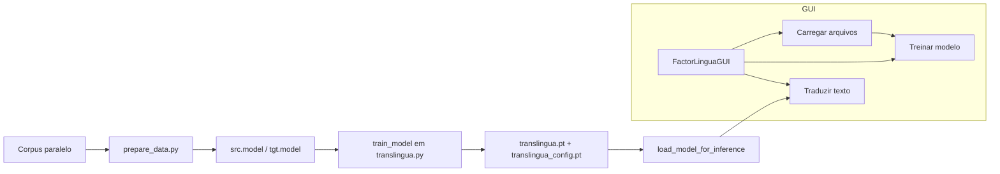

# FactorLinguaNLP

FactorLinguaNLP é um sistema completo de **tradução neural** (NMT) inspirado no Transformer, criado inicialmente com um único arquivo (`translingua.py`) e hoje expandido com **pipeline de dados** (`prepare_data.py`) e **interface gráfica** (`factorlingua_gui.py`). É um projeto educacional e extensível, que demonstra como construir um tradutor neural de ponta a ponta — da tokenização ao uso via GUI.

---

## ✨ Principais destaques

* **Atenção hierárquica**: une atenção **local** (janela de contexto) e **global**, controladas por um *gate* treinável.
* **Codificação posicional dinâmica**: seno/cosseno com escala **aprendida pelo modelo**.
* **Embeddings fatorizados**: compressão de vocabulário para reduzir parâmetros e projetar em `d_model`.
* **Treinamento estável**: label smoothing, grad clipping e seeds reprodutíveis.
* **Inferência robusta**: `greedy_decode` lida com entradas vazias, tokenizações curtas e tokens inválidos.
* **API clara**: funções dedicadas para carregar modelo/configuração e traduzir via Python ou GUI.
* **Ferramenta de preparação**: `prepare_data.py` cria os tokenizadores SentencePiece.
* **Interface gráfica (Tkinter)**: `factorlingua_gui.py` permite treinar e traduzir sem terminal.

---

## 📂 Estrutura do projeto

### `translingua.py`

Coração do sistema:

* **Modelo**: `TranslinguaModel` (encoder-decoder Transformer customizado).
* **Componentes**: atenção hierárquica, embeddings fatorizados, positional encoding dinâmico.
* **Dataset**: `TranslationDataset` com BOS/EOS, truncamento e padding.
* **Treinamento**: `train_model(...)` salva pesos + config.
* **Inferência**: `greedy_decode(...)` e `load_model_for_inference(...)`.

### `prepare_data.py`

* Treina modelos **SentencePiece** para origem e destino.
* Gera `src.model`, `src.vocab`, `tgt.model`, `tgt.vocab`.
* Usa BPE com alta cobertura de caracteres.

### `factorlingua_gui.py`

Interface gráfica para:

* Selecionar arquivos de treino.
* Iniciar treinamento com barra de log.
* Carregar modelo salvo.
* Traduzir textos digitados.
* Visualizar tokens de entrada (debug).
* Receber feedback visual com ícones (✅/❌/📂/🚀/🌐).

---

## 🧠 Pipeline completo

1. **Preparação de dados**

   * Rodar `prepare_data.py` com `frases_src.txt` e `frases_tgt.txt`.
   * Saída: `src.model` e `tgt.model`.

2. **Treinamento**

   * Executar `train_model(...)` com `train.src` e `train.tgt`.
   * Saída: `translingua.pt` (pesos) e `translingua_config.pt` (configuração).

3. **Inferência**

   * Carregar com `load_model_for_inference(...)`.
   * Traduzir com `greedy_decode(...)`.

4. **Interface Gráfica**

   * Usar `factorlingua_gui.py` para treinar e traduzir sem precisar do terminal.

---

## 🔩 Fluxo em diagrama



---

## 🚀 Como usar

### 1. Preparar tokenizadores

```bash
python prepare_data.py
```

> Gera `src.model`, `tgt.model`, `src.vocab`, `tgt.vocab`.

### 2. Treinar modelo

```bash
python translingua.py
```

Ou programaticamente:

```python
from translingua import train_model

model = train_model(
    src_model_path="src.model",
    tgt_model_path="tgt.model",
    src_file="train.src",
    tgt_file="train.tgt",
    epochs=5,
)
```

### 3. Traduzir frases

```python
from translingua import load_model_for_inference, greedy_decode

model, src_sp, tgt_sp = load_model_for_inference(
    model_path="translingua.pt",
    config_path="translingua_config.pt",
    src_spm_path="src.model",
    tgt_spm_path="tgt.model",
)

print(greedy_decode(model, src_sp, tgt_sp, "hello world"))
```

### 4. Usar a interface gráfica

```bash
python factorlingua_gui.py
```

Interface abre com botões para carregar dados, treinar e traduzir.

---

## 📈 Avaliação

* **Loss/token**: exibido durante o treino.
* **BLEU** e **chrF** recomendados via sacrebleu.
* **Curvas de treino** podem ser plotadas com matplotlib.

---

## 🛠️ Requisitos

### Requisitos mínimos e recomendados

| Categoria     | Mínimo                             | Recomendado                          |
| ------------- | ---------------------------------- | ------------------------------------ |
| CPU           | Intel i5 4ª geração ou equivalente | Intel i7/i9 ou AMD Ryzen 7+          |
| GPU           | NVIDIA GTX 1050 Ti (4GB VRAM)      | NVIDIA RTX 3060 (12GB VRAM) ou acima |
| RAM           | 8 GB                               | 16 GB ou mais                        |
| Armazenamento | 5 GB livres                        | SSD NVMe 20 GB+                      |
| SO            | Windows 10 / Linux Ubuntu 20.04+   | Linux Ubuntu 22.04 / Windows 11 Pro  |

### Advertências de uso

* **Treinamento em GPU**: pode gerar aquecimento intenso. Certifique-se de ter refrigeração adequada.
* **GPUs de entrada (ex.: 1050 Ti)**: podem sofrer lentidão em datasets grandes. Prefira **batches pequenos**.
* **Uso em CPU**: possível, mas extremamente mais lento.
* **Longos períodos de treino**: podem causar desgaste de componentes, especialmente em hardware antigo.
* **Recomendação**: monitore temperatura e consumo elétrico durante treinos longos.

---

## 💻 IDEs recomendadas

| IDE        | Vantagens principais                                                       |
| ---------- | -------------------------------------------------------------------------- |
| VS Code    | Leve, excelente suporte a Python, Jupyter, Git e plugins de produtividade. |
| PyCharm    | Refatoração avançada, inspeções estáticas, ideal para projetos maiores.    |
| JupyterLab | Experimentos rápidos, ótima integração com visualizações.                  |
| Spyder     | Ambiente científico com integração forte em análise de dados.              |

---

## 📚 Possíveis Cases para uso dessa ferramenta

* Tradução geral e de domínios específicos (jurídico, médico, etc.).
* Legendas curtas (benefício do contexto local).
* Educação/pesquisa: comparar efeitos da atenção local vs global.
* Aplicações embarcadas: embeddings fatorizados reduzem memória.

---

## 📊 Exemplos de tradução

```text
EN: "He is reading a book."  
PT: "Ele está lendo um livro."

ES: "Hola mundo."  
EN: "Hello world."
```

> Resultados reais podem variar conforme os dados de treino e tempo de treinamento.

---

## 🧪 Benchmarking inicial

* Treino rápido em \~1k pares de frases resulta em traduções básicas compreensíveis.
* Para corpora maiores (50k+ frases), espera-se BLEU entre 15–25 (dependendo do domínio).
* Recomenda-se avaliação com **sacrebleu** para padronização.

---

## 🛣️ Roadmap de evolução

* [ ] Implementar beam search com length penalty.
* [ ] Suporte a múltiplos pares de idiomas.
* [ ] Exportação para ONNX para inferência rápida.
* [ ] Treinamento distribuído multi-GPU.
* [ ] Fine-tuning em domínios específicos (jurídico, técnico, saúde).

---

## 🌐 Contribuições

* Issues e sugestões são bem-vindas no repositório.
* Pull requests podem incluir:

  * Novos scripts de pré-processamento.
  * Melhorias na interface gráfica.
  * Novos métodos de inferência (ex.: beam search).

---

## 📄 Licença

### English (Original)

MIT License

Copyright (c) 2025 Elvis Alves

Permission is hereby granted, free of charge, to any person obtaining a copy
of this software and associated documentation files (the "Software"), to deal
in the Software without restriction, including without limitation the rights
to use, copy, modify, merge, publish, distribute, sublicense, and/or sell
copies of the Software, and to permit persons to whom the Software is
furnished to do so, subject to the following conditions:

The above copyright notice and this permission notice shall be included in all
copies or substantial portions of the Software.

THE SOFTWARE IS PROVIDED "AS IS", WITHOUT WARRANTY OF ANY KIND, EXPRESS OR
IMPLIED, INCLUDING BUT NOT LIMITED TO THE WARRANTIES OF MERCHANTABILITY,
FITNESS FOR A PARTICULAR PURPOSE AND NONINFRINGEMENT. IN NO EVENT SHALL THE
AUTHORS OR COPYRIGHT HOLDERS BE LIABLE FOR ANY CLAIM, DAMAGES OR OTHER
LIABILITY, WHETHER IN AN ACTION OF CONTRACT, TORT OR OTHERWISE, ARISING FROM,
OUT OF OR IN CONNECTION WITH THE SOFTWARE OR THE USE OR OTHER DEALINGS IN THE
SOFTWARE.

### Português (Tradução)

Licença MIT

Copyright (c) 2025 Elvis Alves

É concedida permissão, gratuitamente, a qualquer pessoa que obtenha uma cópia
deste software e dos arquivos de documentação associados (o "Software"), para
negociar o Software sem restrição, incluindo, sem limitação, os direitos de
usar, copiar, modificar, mesclar, publicar, distribuir, sublicenciar e/ou vender
cópias do Software, e permitir que as pessoas a quem o Software é fornecido o
façam, sujeito às seguintes condições:

O aviso de copyright acima e este aviso de permissão devem ser incluídos em
todas as cópias ou partes substanciais do Software.

O SOFTWARE É FORNECIDO "NO ESTADO EM QUE SE ENCONTRA", SEM GARANTIA DE QUALQUER
TIPO, EXPRESSA OU IMPLÍCITA, INCLUINDO, MAS NÃO SE LIMITANDO ÀS GARANTIAS DE
COMERCIALIZAÇÃO, ADEQUAÇÃO A UM DETERMINADO FIM E NÃO INFRAÇÃO. EM NENHUM CASO
OS AUTORES OU DETENTORES DOS DIREITOS AUTORAIS SERÃO RESPONSÁVEIS POR QUALQUER
RECLAMAÇÃO, DANOS OU OUTRA RESPONSABILIDADE, SEJA EM UMA AÇÃO DE CONTRATO, ILÍCITO
OU DE OUTRA FORMA, DECORRENTE DE, FORA OU EM CONEXÃO COM O SOFTWARE OU O USO OU
OUTRAS NEGOCIAÇÕES NO SOFTWARE.

---

### ✅ Resumo final

* `translingua.py` → núcleo Transformer + treino + inferência.
* `prepare_data.py` → tokenizadores SentencePiece.
* `factorlingua_gui.py` → interface gráfica.

👉 O **FactorLinguaNLP** evoluiu de um único script para um **ecossistema completo de tradução neural**, cobrindo todo o ciclo: **pré-processamento → treino → inferência → interface gráfica**.
